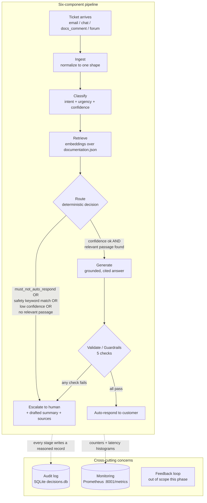
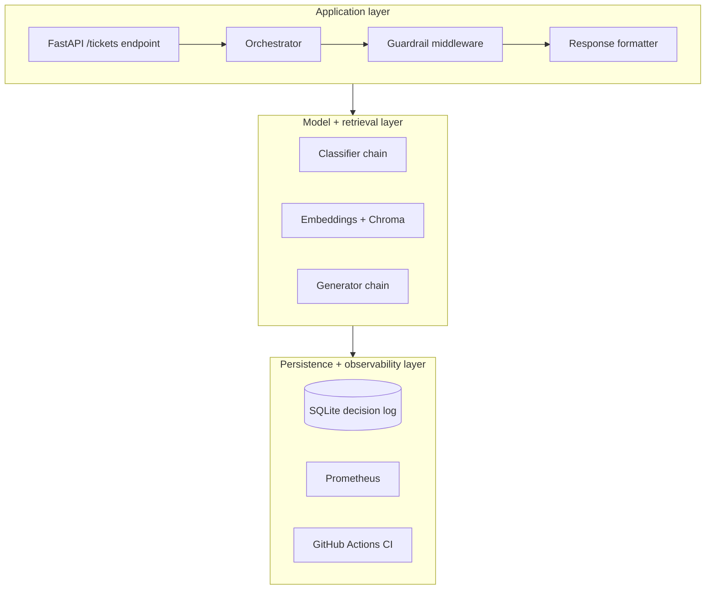

# Architecture

## Why this shape, not the brief's diagram followed blindly

The Project Brief's six components (Ingest → Classify → Retrieve → Route → Generate →
Validate) over three cross-cutting concerns (audit log, monitoring, feedback loop) are adopted
largely as given, because discovery didn't surface a reason to depart from them structurally.
What discovery *did* change is where the emphasis sits: retrieval quality is the load-bearing
component, not generation. 71.4% of tickets are answerable from documentation and 49.1% of
escalations were themselves answerable — the system's value is overwhelmingly in reliably
finding an answer that already exists, not in generating novel text. Generation and guardrails
matter, but retrieve+route is where discovery says the money is.

Named explicitly, since the Brief describes the shape by component rather than by this term:
the retrieve-then-generate pair at the center of this pipeline is a standard **retrieval-
augmented generation (RAG)** architecture over CloudServe's own documentation corpus — the
classify/route/validate stages around it exist to decide *when* to trust that RAG output
enough to send it unattended, and what to do when not to.

## Diagram

The first diagram is the request-level flow (what happens to one ticket); the second is the
structural layering referenced in "Layers" below (why the code is organized the way it is).

## Components

| Component | Implementation choice | Why |
|---|---|---|
| Ingest | `src/ingest.py` — one normalizer function per channel, converging on a single `NormalizedTicket` shape (Pydantic model) that preserves `raw_text` and `channel` | Four channels (email 42.4%, chat 31.0%, docs_comment 15.6%, forum 11.0%) must not leak channel-specific quirks downstream (A2) |
| Retrieve | Chroma (local, on-disk) + `all-MiniLM-L6-v2` embeddings over `documentation.json`; `RecursiveCharacterTextSplitter`, starting chunk_size=800/overlap=120, compared against one alternative split | Ines: articles have a consistent title/symptoms/causes/steps/notes structure — splitting inside a resolution sequence produces passages that retrieve well but read as incomplete, so chunk boundaries are chosen with that structure in mind, not defaulted |
| Classify | LLM-prompted classification (few-shot, 22-class intent + urgency) via OpenRouter/Groq free tier, with `must_not_auto_respond` treated as a **hard-coded lookup from the labelled taxonomy** rather than a model prediction, since a false negative there is a governance failure, not a scoring loss | A model-predicted safety flag would itself need a precision/recall figure trusted enough to gate automation — since the taxonomy already labels which *intents* fall in this category, mapping intent→must-escalate is more reliable than asking the model to separately judge "is this dangerous" |
| Route | Deterministic function: `must_not_auto_respond` → escalate; else confidence ≥ threshold AND retrieval passed relevance floor AND guardrails pass → auto-respond; else → escalate | Same input always yields same output (A5); threshold derived from Day 3 precision/recall data, not the 0.80 default left unexamined. **Caveat found by a pre-submission clean-room test**: `decide()` itself is genuinely a pure function of its inputs, but the classify/generate calls that produce those inputs are not reliably deterministic on a cold cache — the free-tier provider doesn't honor `temperature=0`/`seed=0` as a hard guarantee on live calls. See report §7 sixth caveat and revision log §4f for the full finding |
| Generate | Grounded generation prompt with ticket content and system instructions in clearly delimited, separate message roles (defends against prompt injection, FR-10); structured JSON output (answer, citations, confidence-statement) | Structured output is required for the guardrail layer and decision log to parse reliably (Build Spec: Generate) |
| Validate/Guardrails | Five checks run on every response before release: private-data, grounding (every claim traceable to a retrieved passage), instruction-integrity, tone/scope (no refund/timeline commitments — Daniel), confidence-floor. Each can **block** | A guardrail that only warns is not a guardrail (Build Spec §03) |

## Cross-cutting concerns

- **Audit log**: SQLite (`storage/decisions.db`), schema per Governance Framework's minimum
  decision record. Written at every stage (classification, routing, generation, validation),
  not just on success — a decision log written only for successful tickets fails A8's
  reconciliation check.
- **Monitoring**: Prometheus counters/histograms exposed on `:8001/metrics` (tickets processed
  by channel/outcome, response latency, guardrail activations); a minimal Grafana dashboard.
- **Feedback loop**: out of scope for this project's timeline (no live customers to feed back
  from) — noted explicitly in the PRD's out-of-scope section rather than silently dropped.

## Layers (Setup Guide's three-layer separation, adopted as-is)

Application layer (FastAPI endpoint → orchestrator → guardrail middleware → response
formatter) sits over the model+retrieval layer (classifier, embeddings, Chroma, generator),
which sits over persistence+observability (SQLite decision log, Prometheus, GitHub Actions
CI). Separating these is what lets the vector store or model provider be swapped without
rewriting the parts that depend on them, per the Setup Guide's stated rationale.

## Final decisions (resolved)

These three questions were originally left open pending Day 3 build data. All three were
closed by the end of the build. Kept here rather than deleted, so the trail from open question
to resolution stays visible.

| Question | Resolution | Why | Full reasoning |
|---|---|---|---|
| Final confidence threshold | Kept at the 0.80 default | A Day 3 20-ticket spot check (95% classification accuracy) didn't surface a reason to move it, and the compressed timeline prioritized the full gate run and governance work over a dedicated precision/recall sweep | `Stage_5_PRD_Revision_Log_v1.md` §4 |
| Final chunk configuration | Kept at chunk_size=800/overlap=120, single configuration, not A/B compared against a second | The 29 articles' consistent title/symptoms/causes/steps/notes structure made this defensible on structural grounds alone; a second-config comparison was cut per the sprint plan's own cut-order | `Stage_5_PRD_Revision_Log_v1.md` §4 |
| Whether `must_not_auto_respond` needs a model-side signal | **Yes** — and this is the single most significant finding of the build. The intent→escalate lookup alone was not actually independent of the classifier it was meant to guard against | A real ticket (`DEV-0003`, a compliance/audit question) was misclassified and nearly auto-answered when it should have hard-escalated — found live during video-prep testing, not by a test suite. Fixed with `src/route.py`'s `_mentions_safety_sensitive_topic`: a deterministic keyword scan over the ticket's raw text, independent of the classifier's own prediction. Re-run result: zero missed must-escalate tickets, down from one. | `Stage_5_PRD_Revision_Log_v1.md` §4c, `Governance_Framework_DRAFT.md` risk R-09 |
